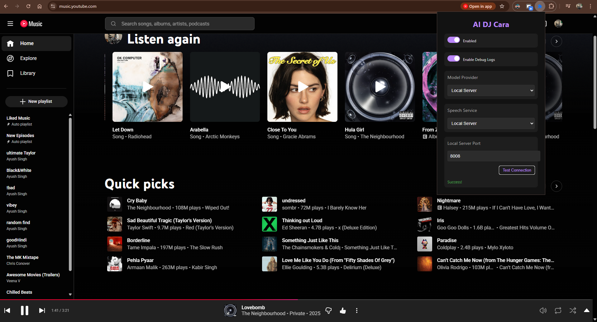

# AI DJ Cara - Your Personal AI Radio Jockey 🎙️🎵

> probably the best fucking thing I've ever coded for myself

**AI DJ Cara** transforms your YouTube Music experience by adding a personality to your playlist. Just like a real Radio Jockey, Cara introduces the next song with hype, wit, and energy, making your listening session feel like a live radio show curated just for you.

## Why?
Remember DJ Cara from NonStopPop FM in GTA V? Ja, I wanted something similar for my Playlists. If you decide to use local-server, you can even clone and use the exact voice :)

## Screenshot



## Features

*   **Gemini API Support**: Connects to Google's powerful Gemini models for high-quality, fast, and free generations.
*   **WebLLM Support**: Runs powerful local LLMs directly in your browser using WebGPU for privacy and offline capability.
*   **Local Server Support**: Connect to your own local Python server for maximum control, custom models, and zero-compromise performance.
*   **Smart Caching & Pre-fetch**: Automatically anticipates song transitions, pre-generates scripts, and pre-fetches high-quality audio to ensure instant, seamless playback without delays.
*   **Dynamic Speech**: Supports Chrome TTS, Kokoro JS (In-Browser), Local XTTS v2, and Gemini API for realistic voice output.

## Recommended way to use

The recommended way to use AI DJ Cara is with the **Gemini API**. It's fast, reliable, and offers a great balance of quality and performance.

1.  **Get a Free API Key**: Visit [Google AI Studio](https://aistudio.google.com/app/apikey) and create a free API key.
2.  **Configure**: Enter your API key in the extension settings.
3.  **Check Limits**: Be aware of the [rate limits for the free tier](https://ai.google.dev/gemini-api/docs/models/gemini#rate-limits).

## Download

You can download the compiled version (excluding WebLLM for a smaller file size) from the [Releases](https://github.com/your-repo/ai_dj_cara/releases) tab.

## Installation & Setup

### Part 1: Chrome Extension

1.  **Clone the Repository**

    ```bash
    git clone https://github.com/your-repo/ai_dj_cara.git
    cd ai_dj_cara
    ```

2.  **Install Dependencies & Build**
    - **Standard Build (Default)** - _Optimized size, includes Gemini API support only._

      ```bash
      npm install
      npm run build
      ```

    - **Build with WebLLM** - _Large size, enables local browser LLM._
      ```bash
      npm install
      npm run build -- --env webllm
      ```

3.  **Load into Chrome**
    - Open Chrome and go to `chrome://extensions`.
    - Enable **Developer mode** (top right).
    - Click **Load unpacked**.
    - Select the `dist` folder generated in your project directory.

4.  **Get Your Free Gemini API Key**
    - Go to [Google AI Studio](https://aistudio.google.com/app/apikey).
    - Click **Create API key**.
    - Copy the key. You'll need it in the extension settings.

### Part 2: Local Server (Optional - For High Quality Voice & LLM)

To unlock the full potential of **AI DJ Cara** with realistic voices (XTTS) and powerful LLMs (Llama), you can run the local server component.

#### Prerequisites

- Python 3.10+
- NVIDIA GPU with CUDA support (Recommended for acceptable performance)
- ~8GB VRAM for 8B models + XTTS

#### Setup Instructions

1.  **Clone Server Repository**

    The server code is hosted in a separate repository.

    ```bash
    git clone https://github.com/WinterSoldier13/dj_cara_server
    cd dj_cara_server
    ```

2.  **Install Python Requirements**
    Basic CPU installation:

    ```bash
    pip install -r requirements.txt
    ```

    **🚀 For CUDA (GPU) Support (Highly Recommended)**:
    You must install the CUDA-enabled version of PyTorch. Run this command _before_ or _instead_ of the standard torch install:

    ```bash
    pip install torch torchvision torchaudio --index-url https://download.pytorch.org/whl/cu121
    pip install -r requirements.txt
    ```

    _Note: Adjust `cu121` to match your installed CUDA version (e.g., cu118)._

3.  **Download Models**
    - **LLM**: Download a GGUF model (e.g., `Llama-3.1-8B-Instruct-Q4_K_M.gguf`) from HuggingFace.
    - **TTS**: The server uses Coqui XTTS v2. It will attempt to look for models in the defined path.
    - _Configuration_: Open `server.py` and update the paths to your models:
      ```python
      LLM_PATH = "D:/path/to/your/llama.gguf"
      SPEECH_MODEL_PATH = "D:/path/to/xtts_model_folder"
      ```

4.  **Run the Server**

    ```bash
    python server.py --start_llm --port 5000
    ```

    - `--start_llm`: Enables the LLM service. Omit if you only want to use the local TTS with WebLLM/Gemini.

## Configuration

*   **Model Provider**: Choose between Gemini API (recommended), WebLLM, or Local Server.
*   **Speech Provider**: Select the voice service (Gemini API, Kokoro JS, Chrome TTS, or Local Server).
*   **API Key**: Enter your Gemini API key if using the Gemini API provider.
*   **Local Server Port**: Set the port for your local server (default is 8008) if using the Local Server provider.

## FAQ

*   **Local Server Performance**: To use the local server effectively for fast responses, you should have a GPU with CUDA support.
*   **Debugging**: If you encounter issues, enable "Debug Mode" in the extension settings. Then, check the console logs of the YouTube Music tab, the extension's service worker, and the `offscreen.html` page (accessible via `chrome://extensions` -> Details -> Inspect views).
*   **Gemini API Limits**: If the extension stops working suddenly while using the Gemini API, you may have hit the rate limits.

## Contribution

Please create an Issue first to discuss your ideas before working on a PR.
*   **Good First Issue**: Integrating AI DJ Cara with Spotify Web would be a fantastic contribution!

## LICENSE

We use a custom license for this project, please read it at [LICENSE](LICENSE).
